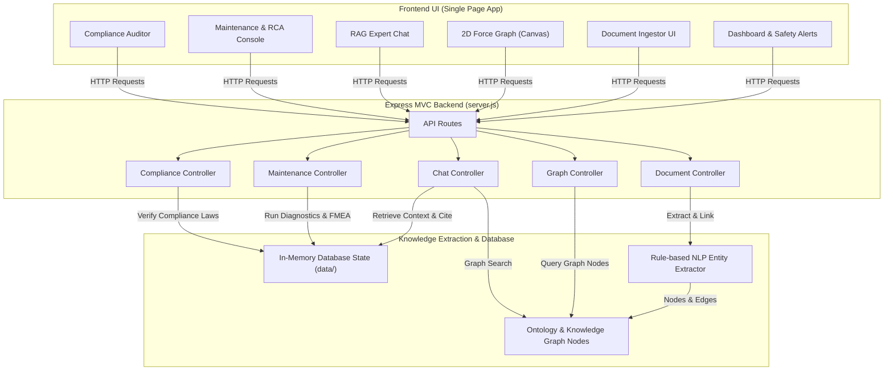

# Walkthrough: Unified Asset & Operations Brain Deliverables

This walkthrough outlines all key deliverables for the **Unified Asset & Operations Brain** platform, including execution instructions, architectural design, slide-deck presentation links, and a full interactive demo video.

---

## 🚀 1. Working Prototype

The prototype is a fully functioning Single Page Application (SPA) backed by a Node.js/Express server using MVC architecture. It features raw text OCR ingestion, custom physics-based graph rendering, a RAG copilot with document citation, and automatic compliance and failure analysis (RCA).

### How to Run Locally

1. **Verify/Install Node.js Dependencies** (Run inside the workspace directory):
   ```bash
   npm install
   ```
2. **Start the Express Server**:
   ```bash
   npm run dev
   ```
3. **Open the Application**:
   Navigate to [http://localhost:3000/](http://localhost:3000/) in your web browser.

### Key Codebase Files
- **Server Entrypoint & Routing**: [server.js](file:///c:/Users/Parth/hackathon%20-%20AI%20for%20Industrial%20Knowledge%20Intelligence/server.js)
- **Frontend Markup**: [index.html](file:///c:/Users/Parth/hackathon%20-%20AI%20for%20Industrial%20Knowledge%20Intelligence/public/index.html)
- **Client Application Logic**: [app.js](file:///c:/Users/Parth/hackathon%20-%20AI%20for%20Industrial%20Knowledge%20Intelligence/public/app.js)
- **Design & Theme Stylesheet**: [style.css](file:///c:/Users/Parth/hackathon%20-%20AI%20for%20Industrial%20Knowledge%20Intelligence/public/style.css)
- **Controllers & Services**: Located in the [src](file:///c:/Users/Parth/hackathon%20-%20AI%20for%20Industrial%20Knowledge%20Intelligence/src) folder structure.

---

## 📊 2. Architecture Diagram

The application implements a decoupled MVC (Model-View-Controller) pattern with modular NLP extraction and vector/graph RAG searching. Below is the block flowchart:



---

## 📢 3. Presentation Deck

We have built a dedicated **Pitch Deck / Presentation** served directly by the web server. It contains slides covering the market challenge (the industrial knowledge cliff), our universal ingestion pipeline, core value propositions, and future roadmaps.

- **Access URL**: [http://localhost:3000/presentation.html](http://localhost:3000/presentation.html)
- **Source File**: [presentation.html](file:///c:/Users/Parth/hackathon%20-%20AI%20for%20Industrial%20Knowledge%20Intelligence/public/presentation.html)

> [!TIP]
> You can also click the **"Pitch Deck"** shortcut button directly in the top header of the main dashboard to open it in a new browser tab.

---

## 🎥 4. Demo Video & Visuals

Here is the automatically recorded walk-through demonstration showing the prototype in action:

### Walkthrough Demo Video


---

### Interactive UI Highlights

Below are screenshots captured during the walkthrough showing individual dashboard components:

````carousel

<!-- slide -->

<!-- slide -->

````
